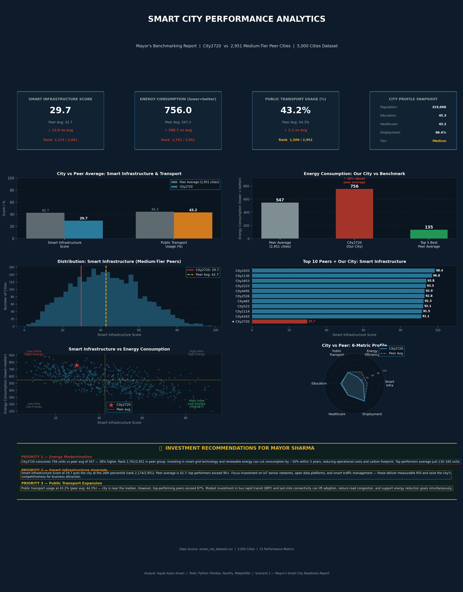
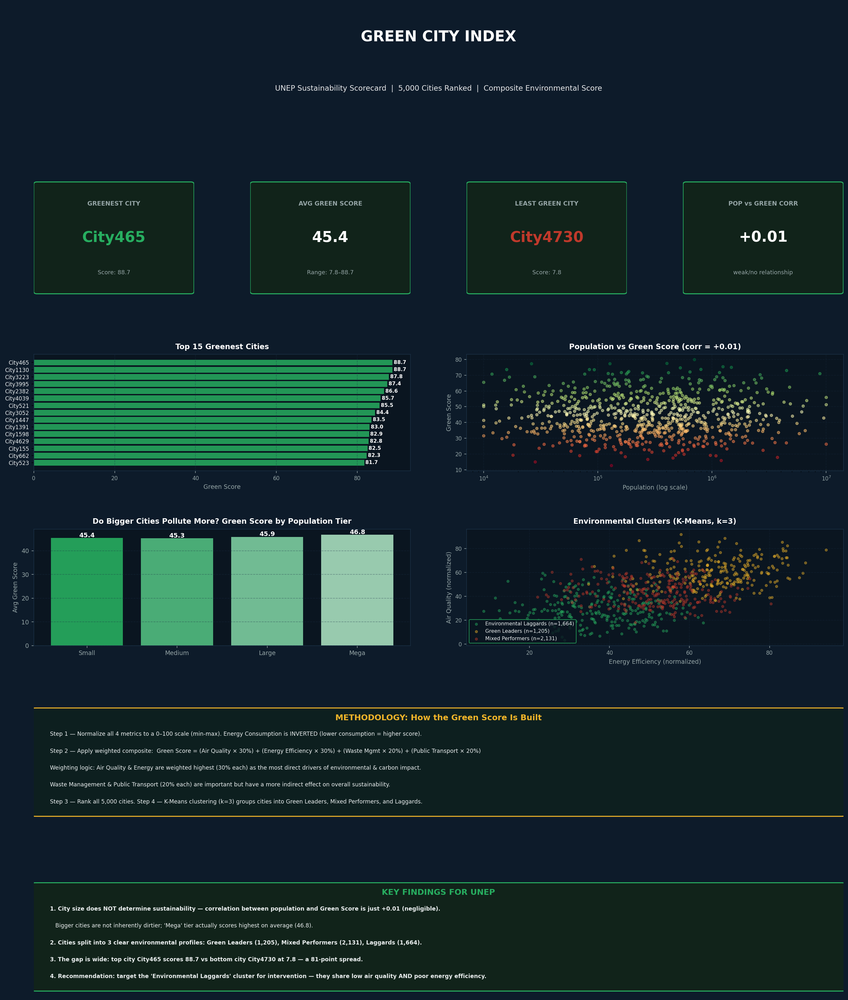
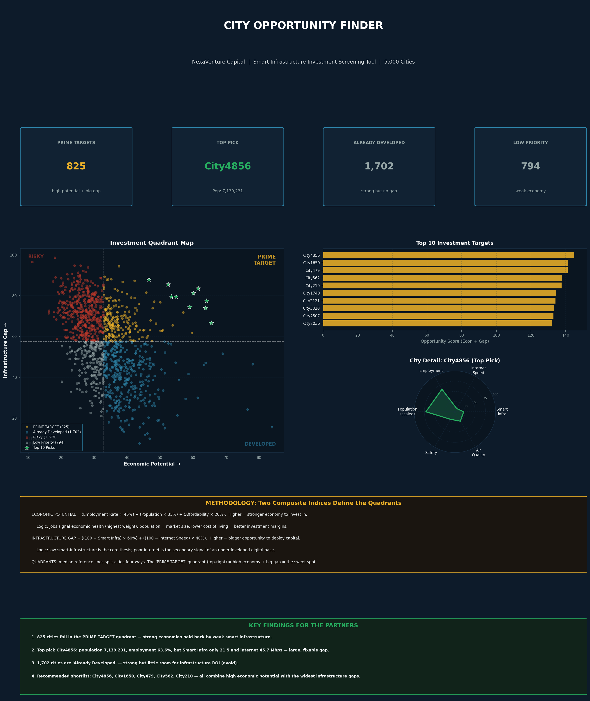
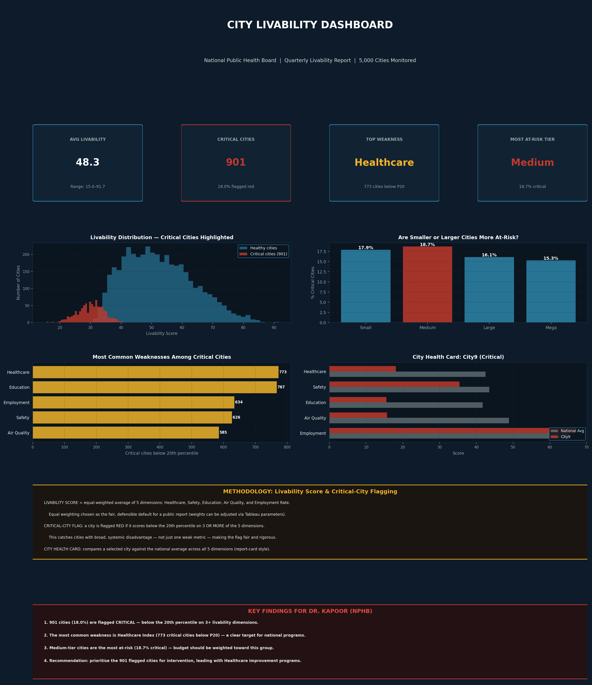

# Smart City Performance Analytics — Full Capstone
### Tableau & Python Capstone | PhysicsWallah × PwC — Data Analytics with AI (NSDC Certified)

A complete urban-analytics capstone covering **all 4 real-world scenarios** on a dataset of
**5,000 cities × 15 performance metrics**. Each scenario simulates a different organisation,
stakeholder, and business question — built end to end: data exploration, composite scoring,
visualization, and stakeholder recommendations.

---

## The 4 Scenarios

| # | Scenario | Organisation | Core Technique | Dashboard |
|---|----------|-------------|----------------|-----------|
| 1 | Mayor's Readiness Report | UrbanMetrics Consulting | Peer benchmarking, percentile ranking | `smart_city_dashboard.png` |
| 2 | Green City Index | GreenFuture Analytics (UNEP) | Weighted composite score, K-Means clustering | `s2_green_city_dashboard.png` |
| 3 | City Opportunity Finder | NexaVenture Capital | Quadrant analysis, 2 composite indices | `s3_investment_dashboard.png` |
| 4 | Livability Dashboard | National Public Health Board | Percentile flagging logic, parameter weights | `s4_livability_dashboard.png` |

---

## Scenario 1 — Mayor's Smart City Readiness Report
Benchmarked City2720 (pop. 319,006) against 2,951 medium-tier peers. Found it ranks in the
**bottom 6% for energy efficiency** (38% above peer-average consumption) and **26th percentile
for smart infrastructure**. Delivered 3 prioritised investment recommendations.

## Scenario 2 — Green City Index
Built a weighted **Green Score** (Air Quality 30%, Energy 30%, Waste 20%, Transport 20%) and
ranked all 5,000 cities. Key insight: **city size has near-zero correlation with sustainability**
(r = +0.01). K-Means clustering found 3 distinct environmental profiles.

## Scenario 3 — City Opportunity Finder
Created two composite indices — **Economic Potential** and **Infrastructure Gap** — to build an
investment quadrant map. Identified **825 PRIME TARGET cities** (strong economy + weak
infrastructure = high ROI potential) and a top-10 shortlist for the partners.

## Scenario 4 — Livability Dashboard
Built an equal-weighted **Livability Score** and a **critical-city flagging system** (below 20th
percentile on 3+ of 5 dimensions). Flagged **901 critical cities (18%)**, with Healthcare as the
most common weakness. Includes a report-card-style City Health Card.

---

## Repository Contents

| File | Description |
|------|-------------|
| `smart_city_dataset.csv` | 5,000 cities × 15 metrics dataset |
| `generate_data.py` | Reproduces the dataset |
| `analysis.py` / `dashboard.py` | Scenario 1 analysis + dashboard |
| `s2_analysis.py` / `s3_analysis.py` / `s4_analysis.py` | Scenarios 2–4 analysis + dashboards |
| `key_findings.md` | Scenario 1 findings |
| `S2_Green_City_Index.md` | Scenario 2 findings, methodology, self-assessment |
| `S3_Investment_Finder.md` | Scenario 3 findings, methodology, self-assessment |
| `S4_Livability_Dashboard.md` | Scenario 4 findings, methodology, self-assessment |
| `*.png` | Dashboard images for all 4 scenarios |

---

## Tools & Skills

**Tools:** Python (Pandas, NumPy, Matplotlib, scikit-learn), Tableau, Excel

**Skills demonstrated:**
- Composite index design with normalisation and justified weighting
- Peer benchmarking and percentile ranking across thousands of records
- K-Means clustering for segmentation
- Quadrant / decision-support tool design
- Percentile-based flagging logic (nested conditional logic)
- Translating analysis into stakeholder-ready recommendations for non-technical audiences

---

## About

**Aquib Azam Ansari**
MBA in Agribusiness Management | Data Analytics with AI (NSDC & PwC Certified)
Email: aquib.azam8@gmail.com

*Completed as part of the PhysicsWallah Data Analytics with AI program (Oct 2025 – May 2026), NSDC & PwC certified.*
